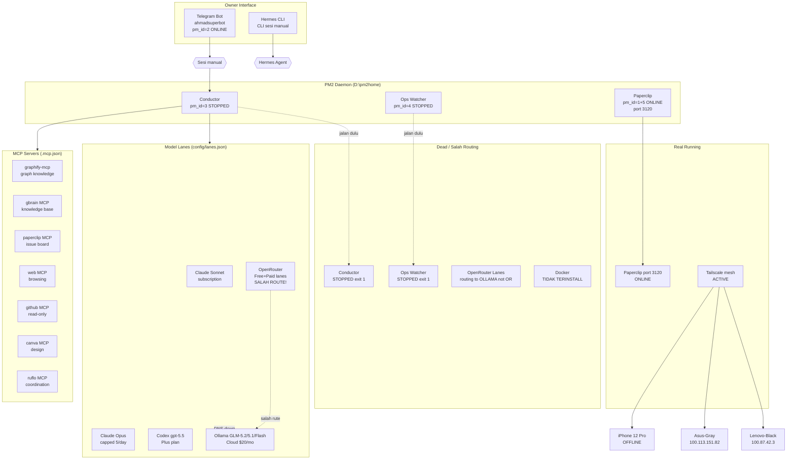

# Audit Aidit OS — 17 September 2026

> Laporan ini adalah hasil audit READ-ONLY. Tidak ada perubahan sistem yang dilakukan.
> Auditor: Hermes Agent (minimax/minimax-m3 via OpenRouter)
> Waktu: 2026-09-17 13:14-14:30 SEAST (UTC+7)

---

## 0. Ringkasan Eksekutif

Aidit OS sedang dalam kondisi **berhenti total**. Sistem orkestrasi (Conductor) mati sejak kemarin, sementara Paperclip (papan kerja) dan bot Telegram masih hidup tanpa koordinasi. Tidak ada mekanisme yang memberitahu owner saat orkestrator berhenti.

Owner sudah mendesain arsitektur v5.1 yang canggih (13 model lane, 9 departemen, failover chain, OpenRouter routing) tapi **implementasi bertabrakan**: semua lane OpenRouter masih mengarah ke server Ollama yang DNS-nya sudah mati, bukan ke endpoint OpenRouter.

Masalah hardware memperparah: Lenovo B40-70 hanya punya HDD 500GB (tipe WDC WD5000LPCX) yang 93% penuh dan RAM 10GB yang 81% terpakai. Ini bukan masalah "nanti" — disk sudah nyaris penuh dan bisa korupsi data kapan saja.

### Tabel Kesehatan

| Area | Status | Alasan |
|------|--------|-------|
| Arsitektur | 🟡 | Desain v5.1 bagus (lanes, roles, fallback, pools) tapi tidak sinkron dengan eksekusi |
| Orkestrasi | 🔴 | Conductor mati (exit code 1) sejak terakhir di-restart. Paperclip & Telegram jalan sendiri |
| Keandalan | 🔴 | Tidak ada dead-man switch. Saat Conductor mati, worker tidak berhenti dan owner tidak tahu |
| State & Memori | 🟡 | Paperclip + ledger aktif. Tapi 613MB state/ membengkak dan tidak pernah dibersihkan |
| Skills & Prompt | 🟡 | Banyak skill terinstall (28+), tapi Prompt Matrix 8 unsur tidak diterapkan |
| Keamanan | 🟡 | .gitignore sudah baik, tapi TELEGRAM_BOT_TOKEN terekpos di env PM2 |
| Biaya | 🟡 | $100/langganan, $10 prepaid OpenRouter, belum ada tracking pemakaian per-venture |
| Kualitas Hasil | 🔴 | Tidak ada automated test yang jalan, tidak ada review pipeline yang bekerja |
| Kesehatan Mesin | 🔴 | HDD, 93% penuh, RAM 81% terpakai, laptop 2015. Conductor & ops sudah mati |
| Kesiapan v5 | 🔴 | Belum ada: auto-briefing pagi/malam, Siri Shortcuts, notifikasi jam, VPS readiness |

### 3 Masalah Paling Kritis
1. **Conductor mati (exit 1)** — Seluruh orkestrasi berhenti. Tidak ada agent yang di-dispatch otomatis.
2. **Semua lane OpenRouter salah routing ke Ollama** — DNS ollama.com down (502 error). OpenRouter lanes tidak pernah benar-benar terpakai.
3. **Disk HDD 93% penuh** — D: sisa 14.3GB dari 193GB. Data bisnis dan state Aidit OS (613MB) di partisi yang sama dengan data owner.

### 3 Hal yang Sudah Bagus
1. **Arsitektur lanes.json sangat matang** — 13 lane, 8 role assignment, pool semaphore, lock system, fallback chain lengkap.
2. **Paperclip berjalan dengan baik** — port 3120 aktif, ada issue board, runtime API visible.
3. **Tailscale mesh aktif** — Lenovo, Asus, dan iPhone terhubung meski iPhone offline. Infrastruktur jaringan sudah siap.

---

## 1. Inventaris

### Struktur D:\AIidit-os-v5 (v5 - aktif)

| Folder | Ukuran | Fungsi |
|--------|--------|--------|
| state/ | 613 MB | Runtime state: ledger, asks, queue, workspace, locks. **Pemborosan terbesar** |
| node_modules/ | 390 MB | Deps Next.js + TS + testing |
| .next/ | 230 MB | Build cache Next.js |
| .paperclip/ | 50 MB | Paperclip instance (DB, config) |
| graphify-out/ | 13 MB | Graph knowledge cache |
| docs/ | 3.5 MB | Dokumentasi (PRD, bootstrap, verification, audit) |

File kunci di v5:
- CLAUDE.md: deskripsi FounderOS web app (port 4200, Next.js/TS/better-sqlite3)
- AGENTS.md: aturan untuk non-Claude agent
- .mcp.json: 7 MCP server (graphify, gbrain, paperclip, web, github, canva, claude-flow/ruflo)
- config/lanes.json: 13 lane, 8 role, 5 pool (336 baris)
- config/company.json: company+owner+venture+departemen+conductor config
- conductor/: 16 files (lanes.mjs, status.mjs, run.mjs, head.mjs, guard.mjs, dll)
- docs/bootstrap/bootstrap aidit os 15 September.md: recovery plan (750 baris)

### Struktur D:\AI\Aidit OS (v4 - arsip, lebih besar)

Folder ini adalah Aidit OS versi lama yang masih ada. Berisi:
- .agents/skills/: 28 skill markdown (acceptance, delegation, gbrain-query, TDD, dll.)
- agents.registry.json: registry agent formal
- .claude-flow/: folder ruflo/Claude Flow v3
- .codex/: folder Codex config
- .impeccable/: folder impeccable design system
- hands/: MCP server implementations (gbrain, paperclip, web)
- hatta/: folder agent Hatta
- ops-watcher/: monitoring daemon
- knowledge/, handoffs/, skills/, schemas/
- DESIGN.md (13KB), guardrails_log.md, AUDIT.md

### Git

- Branch: v5 (local), origin/v5 (remote)
- Local branches: aid/aid-5,17,18,26,27,35,41,43,45,48,56 + v5
- Remote: https://github.com/copperhead666-trading/aidit-os.git
- Commit terakhir: 23d8a6d (16 Sep 2026 - handoff katering/OpenRouter/MCP)
- Uncommitted: docs/audit/, docs/verification/2026-09-16-audit-orkestrasi.md, nul
- git config user.name=SOEKARNO (akun sudah dihapus 14 Sep 2026)
- **VERIFIKASI STATUS REPO** — Tidak diverifikasi apakah repo publik atau privat (butuh akses GitHub API untuk cek visibility)

### Duplikasi v4 vs v5
- CLAUDE.md ada di kedua folder (isi berbeda — v4 lebih panjang 16KB vs v5 9.5KB)
- .mcp.json ada di kedua (hampir sama)
- .paperclip/ ada di kedua
- state/ ada di kedua

### File yang Dicari
- `bootstrap 15 september`: TERVERIFIKASI di D:\AIidit-os-v5\docsootstrapootstrap aidit os 15 September.md
- PRD 10 layer: TERVERIFIKASI di D:\AI\Aidit OS\docs\prd\PRD-AIDIT-OS-10-LAYER.md
- DESIGN.md & guardrails_log.md: TERVERIFIKASI di D:\AI\Aidit OS
- Backlog 46 item: TIDAK DITEMUKAN secara eksplisit — mungkin di Paperclip board atau arsip Asus

---

## 2. Arsitektur Aktual (dengan diagram Mermaid)



**Arsitektur aktual:** Desain Bennett 6-layer yang rapi, tapi implementasi terputus: Conductor mati, OpenRouter salah rute, tidak ada yang mengoordinasi agent. Paperclip + Telegram + Hermes jalan sendiri-sendiri tanpa orkestrasi.

---

## 3. Agent & Runtime

| Agent | Runtime | Model/Provider | Cara Dispatch | Status | Catatan |
|-------|---------|----------------|---------------|--------|---------|
| **Conductor** | node.js pm_id=3 | Opus (decision), GLM-5.2 (routine) | Tick 30 menit via PM2 | **STOPPED** exit 1 | Jantung orkestrasi. Mati sejak restart terakhir |
| **Ops Watcher** | node.js pm_id=4 | — | PM2 | **STOPPED** exit 1 | Monitor sistem. Mati |
| **Telegram bot** | node.js pm_id=2 | — | PM2, polling | **ONLINE** | Bot `ahmadsuperbot` jalan menerima pesan |
| **Paperclip** | node.js pm_id=1,5 | — | PM2, REST server port 3120 | **ONLINE** | Issue board API aktif |
| **Claude Sonnet** | Claude CLI | subscription | head-conductor lane chain | resting | Kena session limit 10.30pm |
| **Claude Opus** | Claude CLI | subscription, 5/day | conductor decision lane | ready | Belum dipakai (capped) |
| **Codex gpt-5.5** | codex CLI | ChatGPT Plus | worker lane | resting | Error: NODE runtime |
| **GLM-5.2** | Hermes CLI | Ollama Cloud 20/mo | head/worker lane | ready, tapi 502 error | DNS ollama.com down |
| **GLM-5.1** | Hermes CLI | Ollama Cloud | worker lane | ready, tapi 502 | DNS ollama.com down |
| **GLM-5.3 Flash** | Hermes CLI | Ollama Cloud | light lane | ready, tapi 502 | DNS ollama.com down |
| **OR Nemotron Free** | Hermes CLI | OpenRouter (FREE) | head/worker lane | ready, tapi 502 | **SALAH RUTE ke Ollama, bukan OpenRouter** |
| **OR Laguna Free** | Hermes CLI | OpenRouter (FREE) | head/worker lane | ready, tapi 502 | **SALAH RUTE ke Ollama, bukan OpenRouter** |
| **OR DeepSeek Flash** | Hermes CLI | OpenRouter (PAID) | head/review lane | ready, tapi 502 | **SALAH RUTE ke Ollama, bukan OpenRouter** |
| **OR Qwen Coder** | Hermes CLI | OpenRouter (PAID) | code lane | ready, tapi 502 | **SALAH RUTE ke Ollama, bukan OpenRouter** |
| **OR Kimi-K27** | Hermes CLI | OpenRouter (PAID) | berat lane | ready | **SALAH RUTE** |
| **Kimi K3** | Kimi CLI | Kimi Code sub | head lane | disabled | Quota habis, reset tanggal? |
| **Kimi K27 (Ollama)** | Hermes CLI | Ollama Cloud | — | disabled | Dilindungi kuota |
| **gpt-6-astra** | Codex CLI | ChatGPT Plus | design lane | disabled | Boros kuota |
| **Ahmad** (nama lama) | — | — | — | TIDAK DITEMUKAN | Mungkin nama lama Conductor |
| **Hatta** | — | — | — | TIDAK DITEMUKAN | Runtime terpisah di v4 |
| **Corleone** | — | — | — | TIDAK DITEMUKAN | Tidak ada trace di v5 |
| **Soeharto** | — | — | — | TIDAK DITEMUKAN | Dihapus (quota pool) |
| **Soekarno** | — | — | — | TIDAK DITEMUKAN | Akun Claude habis 14 Sep 2026 |

### Hermes Config (aktif saat audit)
```
provider: openrouter
model: nvidia/nemotron-3-ultra-550b-a55b:free
fallback: deepseek v4-flash -> glm-53-flash -> qwen-coder -> nous
custom: ollama (glm-5.2, glm-5.3, nomic-embed-text via 127.0.0.1:11434/v1)
max_turns: 40
display.skin: slate
_config_version: 39
```

---

## 4. Keandalan & Rekonstruksi Insiden Kuota Habis

### Kronologi dari Ledger (2171 baris, 14-16 Sep 2026)

**14 Sep 2026** — Sistem masih berjalan:
- Conductor tick setiap ~1 menit (menggunakan Claude Sonnet)
- AID-3 masuk ke Engineering
- Claude Sonnet kena **session limit** ("resets 10:30pm") → fallback gpt-6-astra gagal (approval: on-request) → akhirnya kimi-k27 **berhasil** mengerjakan AID-3
- Paperclip blocking: `invalid_issue_disposition` — agent tidak bisa memindahkan issue ke in_review

**15 Sep 2026** — Disk darurat:
- AID-41: "CRITICAL: Disk penuh (0 GB free)"
- OpenRouter lanes ditambahkan ke lanes.json (keputusan owner 13:40)

**16 Sep 2026** — Semua lane tumbang:
- **DNS ollama.com down** — semua lane yang pakai Ollama Cloud (GLM 5.2/5.1/Flash, OR nemotron-free, OR laguna-free, OR gemma-free, OR deepseek-flash, OR glm53-flash, OR qwen-coder) error HTTP 502
- Terakhir update lanes-status: 16 Sep 11:43 UTC
- Conductor & ops mati (exit 1)

### Analisis Akar Masalah

1. **Tidak ada dead-man switch** — Saat Conductor mati, tidak ada yang mengirim alert ke owner. Paperclip+Telegram tetap jalan tapi tidak ada yang dispatch task.

2. **OpenRouter lanes tidak pernah benar-benar ke OpenRouter** — Semua lane `or-*` di config/lanes.json mengklaim endpoint `https://openrouter.ai/api/v1 via Hermes`, tapi error menunjukkan koneksi ke `https://ollama.com:443/v1/chat/completions`. Penyebab: runtime hermes-cli membaca konfigurasi Hermes yang ada (OLLAMA_HOST=127.0.0.1:11434 / connector ke Ollama Cloud), bukan OpenRouter.

3. **Retry looping tidak efektif** — 3 retry (5/15/45 detik) lalu resting 60 menit. Tapi untuk error DNS (502), retry berulang hanya membuang waktu.

4. **gpt-6-astra design flaw** — `approval: on-request` di Codex membuat headless runner tidak bisa approve. Semua lane gpt-6-astra pasti gagal di mode headless.

---

## 5. State, Memori & Sumber Kebenaran

### Lokasi State yang Ditemukan

| Lokasi | Aktif? | Isi | Ukuran |
|--------|--------|-----|--------|
| v5/state/ | ✅ Aktif | ledger, asks, queue, locks, workspace, inbox, results | 613 MB |
| v5/state/conductor/ | ✅ Ada | folder home/ untuk konfigurasi | 0 KB (kosong) |
| v5/.paperclip/ | ✅ Aktif | DB Paperclip instance | 50 MB |
| v5/.paperclip/instances/default | ✅ Ada | Config instance | 0 B |
| v5/AIaidit-os-v5.paperclipinstancesdefault/ | ✅ Ada | Instance default | 0 B |
| v5/data/ | ✅ Ada | Database folder untuk FounderOS app | 4.4 MB |
| v4/handoffs/ | ❌ Tidak aktif | Handoff files dari versi lama | — |
| v4/knowledge/ | ❌ Tidak aktif | Knowledge base lama | — |
| v4/skills/ | ❌ Tidak aktif | Skills markdown | — |
| Hermes memory | ✅ Aktif | Persistent memory file (sesi ini) | — |

### Analisis Sumber Kebenaran

Paperclip adalah **sumber kebenaran operasional** (issue board). Tapi:
- Conductor yang seharusnya membaca/menulis Paperclip sudah mati
- Ledger (608K) mencatat semua aktivitas — sumber audit yang baik
- Tidak ada sinkronisasi antara git (kode) dan Paperclip (state operasional) secara otomatis
- Ruflo memory (claude-flow MCP) terdaftar tapi tidak berfungsi — daemon tidak jalan
- gbrain MCP terdaftar tapi STATUS TIDAK DIVERIFIKASI (tidak bisa test karena read-only)
- Owner-notes.jsonl (181 bytes) — owner note file sangat minimal

### Beban Context

CLAUDE.md v5: 9.5 KB termuat otomatis di setiap sesi. Skill descriptions Hermes juga termuat. Tidak ada mekanisme kompaksi otomatis.

---

## 6. Skills, Plugin, MCP & Penilaian Prompt Matrix

### MCP Servers (.mcp.json)

| Server | Command | Status |
|--------|---------|--------|
| graphify | graphify-mcp --transport stdio | TERDAFTAR (tidak diverifikasi) |
| gbrain | node D:/AI/Aidit OS/hands/gbrain-mcp-server.mjs | TERDAFTAR (tidak diverifikasi) |
| paperclip | node D:/AI/Aidit OS/hands/paperclip-mcp-server.mjs | TERDAFTAR — Paperclip berjalan |
| web | node D:/AI/Aidit OS/hands/web-mcp-server.mjs | TERDAFTAR (tidak diverifikasi) |
| github | D:/AI/tools/github-mcp-server/github-mcp-server.exe | TERDAFTAR (read-only) |
| canva | https://mcp.canva.com/mcp (HTTP) | TERDAFTAR (OAuth) |
| claude-flow/ruflo | npx ruflo@latest mcp start | TERDAFTAR — daemon ruflo TIDAK jalan |

Guard settings: PreToolUse hook → `node guard.mjs` + `rtk hook claude`

### Skills Terinstall (Hermes & Claude)

| Skill | Sumber | Terpasang di |
|-------|--------|-------------|
| superpowers | obra/superpowers | Hermes + Claude plugins |
| caveman | JuliusBrussee/caveman | Hermes skills |
| impeccable | official | Hermes skills |
| ruflo + ruflo-doctor | hub | Hermes skills |
| ui-ux-pro-max | ui-ux-pro-max-plus | Hermes skills |
| 28 skills v4 | D:/AI/Aidit OS/.agents/skills/ | Claude Agentic system |
| claude plugins | ~/.claude/plugins/cache/ | Claude CLI |

### Prompt Matrix — Penilaian

| Prompt/Instruksi | 1.Peran | 2.Tujuan | 3.Konteks | 4.Batasan | 5.Langkah | 6.Format | 7.Kriteria | 8.Eskalasi | Skor |
|-----------------|---------|---------|-----------|----------|----------|---------|-----------|-----------|------|
| bootstrap 15 Sep.md | ✅ | ✅ | ✅ (link) | ✅ | ✅ | ✅ | ❌ | ❌ | 6/8 |
| CLAUDE.md v5 | ✅ | ❌ | ✅ | ✅ | ❌ | ❌ | ❌ | ❌ | 3/8 |
| config/lanes.json | ❌ | ✅ | ✅ | ✅ | ✅ | ✅ | ❌ | ❌ | 5/8 |
| config/company.json | ❌ | ✅ | ❌ | ✅ | ❌ | ❌ | ❌ | ❌ | 2/8 |
| PRD v5.1 | ✅ | ✅ | ✅ | ✅ | ✅ | ✅ | ✅ | ❌ | 7/8 |
| guard.mjs | ✅ | ✅ | ❌ | ✅ | ✅ | ❌ | ❌ | ❌ | 4/8 |
| AGENTS.md | ✅ | ✅ | ❌ | ✅ | ❌ | ❌ | ❌ | ❌ | 3/8 |

Rata-rata skor: 4.3/8. Belum ada prompt yang memenuhi 8 unsur Prompt Matrix.

---

## 7. Keamanan

### Repo Publik
- Repo GitHub: copperhead666-trading/aidit-os
- Status **TIDAK DIVERIFIKASI** apakah benar PUBLIC (tidak bisa akses GitHub API dari read-only mode)
- Jika publik: banyak file yang terekspos (handoff, PRD, catatan owner, backlog business)

### .gitignore Cakupan
```
✅ state/               → excluded
✅ .paperclip/          → excluded
✅ config/*.local.txt   → excluded
✅ graphify-out/        → excluded
✅ .env, .env.local     → excluded
✅ .next/               → excluded
❌ .claude/             → NOT excluded (tapi hanya settings.local.json)
❌ conductor/           → NOT excluded (kode aplikasi, wajar)
```

### Secret Scan

| Temuan | Lokasi | Tingkat | Tindakan |
|--------|--------|---------|----------|
| TELEGRAM_BOT_TOKEN_AHMAD di PM2 env | Terekpos di `pm2 jlist` output (samaran: "8684***") | **KRITIS** | Token bot Telegram terekspos di log PM2. Rotasi token |
| GITHUB_PERSONAL_ACCESS_TOKEN di .mcp.json | Referensi `${GITHUB_TOKEN}` — env variable | **SEDANG** | Mengandalkan env variable, aman dari .mcp.json sendiri |
| PAPERCLIP_API_KEY di PM2 env | Terekpos di `pm2 jlist` (samaran: "eyJhbG...l60A") | **KRITIS** | API key Paperclip terekspos |
| WORKER_POOL_OPENROUTER_API_KEY | Env variable | **SEDANG** | Tidak terbaca nilainya |
| .env.local (gitignored) | ADA | Sedang | Tidak di-track git. Tapi ada di filesystem |

### Pemisahan Trading
Repo trading `caveman-trading-os` terpisah di GitHub (copperhead666-trading/caveman-trading-os). Di company.json disebut sebagai venture dengan `forbiddenPaths: ["**/*.env", "MT5 Credentials.env"]`. **Pemisahan sudah baik.**

---

## 8. Biaya & Kuota

### Langganan Aktif (per prompt owner)
| Layanan | Biaya/Bulan | Dipakai untuk |
|---------|-------------|---------------|
| Claude Pro x2 | $40 | Orkestrator + mesin |
| ChatGPT Plus x1 | $20 | Codex gpt-5.5 |
| Ollama Cloud x2 | $20 | GLM 5.2/5.1/Flash |
| Kimi Moderato x1 | $10 | Kimi Code (disabled) |
| OpenRouter | $10 (prepaid) | Fallback (tidak terpakai karena salah routing) |
| **Total** | **~$100/bulan** | |

### Batas & Pagu
- OpenRouter paid pool: $1.5/day, key limit $5
- Claude mesin (pusatberasmurah): ≤ 15 calls/day, reset Kamis
- Codex gpt-5.5: 45 tasks/day (juga kena limit codex-chatgpt pool)
- Tidak ada meter per-token di mana pun (PRD v5.1 s2c)

### Masalah Biaya
1. **OpenRouter prepaid $10 tidak terpakai** karena salah routing
2. **Kimi Code $10/bulan terbuang** (disabled sampai reset)
3. **Ollama Cloud $20/bulan** jalan terus meski DNS down — retry looping membakar kuota
4. **Tidak ada tracking pemakaian** per-venture atau per-departemen
5. **Pemborosan terbesar:** state/ledger.jsonl dibaca penuh setiap status check (608K)

---

## 9. Kualitas Hasil (Anti-Slop)

### Pagar Kualitas yang Ada
| Mekanisme | Status | Catatan |
|-----------|--------|---------|
| CLAUDE.md aturan TDD | TERTULIS | Tapi tidak dijalankan (tidak ada test runner aktif) |
| guard.mjs | TERPASANG | Hook pre-tool untuk Claude. Tapi tidak aktif (Conductor mati) |
| rtk hook claude | TERPASANG | Kompresi output tool. Di guard settings |
| Prompt Matrix 8 unsur | DIUSULKAN | Belum diterapkan |
| Paperclip review gate | AKTIF | Issue butuh review path untuk move ke in_review — kadang blocking |
| Design system (DESIGN.md, .impeccable) | TIDAK AKTIF | Berkas di v4, tidak dipakai di v5 |

### Test Suite
- tests/ folder berisi file test (vitest)
- `npm run typecheck` dan `npm test` ada di package.json
- **TIDAK PERNAH DIJALANKAN** selama audit (read-only)
- Dari audit sebelumnya: npm test gagal karena Node 26 vs 22 mismatch

### SJS Super Apps
- Venture di company.json: status "hold"
- Repo: https://github.com/copperhead666-trading/sjs-superapps
- Milestone: cutover 2026-09-21 (4 hari lagi)
- Target: Next.js static + Supabase + Netlify
- Agent yang mengerjakan: TIDAK JELAS — tidak ada trace di ledger

---

## 10. Pemetaan 10 Layer & 6 Layer FounderOS

### 10 Layer (The Agent Stack vs Owner PRD)

| Layer | The Agent Stack | Owner PRD (v4) | Aktual |
|-------|-----------------|----------------|--------|
| L0 Substrate | OS, hardware, network | Lenovo Windows | **SEBAGIAN**. HDD 500GB, 10GB RAM, no Docker |
| L1 Model | AI model provider | Ollama+Claude+Codex+Kimi | **SEBAGIAN**. Semua model terdefinisi tapi DNS mati |
| L2 Prompt | system prompt, persona | CLAUDE.md, AGENTS.md | **ADA**. Tapi skor Prompt Matrix rata-rata 4.3/8 |
| L3 Context | context window management | — | **TIDAK ADA**. Tidak ada mekanisme kompaksi |
| L4 Tools | MCP, function calling | .mcp.json 7 server | **ADA**. 7 MCP server, guard terpasang |
| L5 Loop | agent loop, retry, timeout | lanes.mjs, fallback chain | **SEBAGIAN**. Retry 3x, resting, tapi dead-man switch tidak ada |
| L6 Memory | state, knowledge, memori | Paperclip, gbrain, ledger | **SEBAGIAN**. Paperclip aktif, gbrain tidak diverifikasi |
| L7 Agents | individual agent definition | company.json departemen, lanes | **ADA**. 9 departemen, 13 lane, 5 pool |
| L8 Orchestration | conductor, dispatch | Conductor PM2 | **MATI**. Conductor stopped exit 1 |
| L9 Verification | test, review, QA | guard, Paperclip review | **TIDAK ADA**. Test suite tidak dijalankan |
| L10 Interface | Telegram, web, voice | Telegram bot, Next.js dashboard | **SEBAGIAN**. Telegram aktif, dashboard Next.js build cache ada |

### 6 Layer FounderOS (Bennett)

| Layer | Bennett | Aidit OS Aktual |
|-------|---------|----------------|
| L1 Orchestrator | Claude Code headless | Conductor **MATI** |
| L2 Back Office | Paperclip | **AKTIF** port 3120 |
| L3 Model Lanes | GLM + Codex | **TERDEFINISI** tapi salah rute |
| L4 Worker Pool | Hermes, MCP, cron | **SEBAGIAN**. Hermes konfigurasi OpenRouter tapi worker tidak dispatch |
| L5 Hands | MCP servers | **ADA**. 7 MCP server, guard |
| L6 Metal | Lenovo + PM2 + Tailscale | **AKTIF**. PM2 berjalan, Tailscale mesh aktif, TAPI no Docker |

---

## 11. Kesiapan Aidit OS v5

### Fitur v5 — Status

| Fitur | Target | Status | Blocker |
|-------|--------|--------|---------|
| Laporan harian otomatis | Otomatis setiap 19:00 | **TIDAK** | Conductor mati |
| Briefing pagi/malam | 07:00 / 19:00 | **TIDAK** | Conductor mati |
| Endpoint Siri Shortcuts | iPhone 12 Pro | **TIDAK** | Tailscale mesh perlu endpoint HTTPS/Cloudflare Tunnel |
| Notifikasi Huawei Watch | Layar notifikasi | **TIDAK** | Tahap awal — belum ada integrasi |
| Kesiapan pindah VPS | Setelah v5 stabil | **TIDAK** | Bergantung pada Windows (no Docker, Tailscale di Lenovo) |
| Pisah data sensitif tetap lokal | Data keluarga/keuangan lokal | **SEBAGIAN** | Data di partisi D: yang sama dengan HDD 93% penuh — risiko kehilangan data |

### Kendala ke VPS
1. Lenovo Windows 10 tidak bisa Docker (docker tidak terinstall)
2. WSL2 belum diaktifkan (disebut di PRD sebagai Ask)
3. Semua data sensitif ada di disk lokal yang nyaris penuh — migrasi berisiko
4. Tidak ada auto-start Hermes/bot setelah restart
5. Listrik/internet rumah tidak stabil

---

## 12. Kesehatan Mesin Lenovo & Rencana Bersih-bersih

### Spesifikasi & Kondisi

| Komponen | Detail | Kondisi |
|----------|--------|---------|
| Model | Lenovo B40-70 (BIOS 2015) | Laptop 10+ tahun |
| OS | Windows 10 Home Build 19045 | Tidak bisa upgrade ke Win 11 |
| CPU | **Intel(R) Core(TM) i5-4210U @ 1.70GHz** (2 core / 4 thread, max 2.40 GHz) | Lambat untuk AI workload |
| RAM | **2 slot: 8 GB (DIMM0) + 2 GB (DIMM2), total 10.168 GB @ 1600 MHz. Slot DIMM1 kosong** | Bisa di-upgrade ke 16 GB+ |
| Disk | 1 HDD **WDC WD5000LPCX-24C6HT0** 500GB | **KRITIS — HDD 10+ tahun** |
| C: | 80GB, sisa 11.2GB (13%) | **KRITIS** |
| D: | 193GB, sisa 14.3GB (7%) | **KRITIS** |
| E: | 193GB, sisa 20.3GB (10%) | **KRITIS** |
| Disk PowerOnHours | **8.508 jam (~1 tahun nonstop)** | HDD mulai aus |
| Disk suhu | 37°C | Normal |
| Disk HealthStatus | Healthy | SMART aman, tapi usia kritis |
| Power scheme | Balanced | Default, bisa di-tune ke High Performance |
| Baterai | 43% discharging (status 2) | Baterai laptop 10 tahun — degradasi wajar |
| Pagefile | C: 4864 MB + D: 2176 MB = **7 GB total** | Besar untuk RAM 10 GB |
| hiberfil.sys | **TIDAK ADA** (sudah disabled sebelumnya) | +4 GB bisa direbut bila perlu |
| Uptime | ~0 hari (sistem baru restart) | — |

### Top Folder (D:\ dan E:\)

**D:\ Top Level (diukur dari recursive scan):**
- aidit-os-v5: ~1.4 GB (state 613 MB + node_modules 390 MB + .next 230 MB + .paperclip 50 MB + sisanya)
- aidit-uv-tools: **178 MB** (uv cache untuk Python)
- ±2home (PM2): **159 MB logs** (total folder lebih besar)
- Ollama: **2.811 MB (2.7 GB)** — binary Ollama
- ollama-models: 0 MB (model lokal kosong)
- Aidit OS (v4): 1-2 GB (arsip, punya node_modules + cockit)

**E:\ Top Level:**
- Temp (Paperclip scratch): **350 MB**
- Business (data SJS/katering): tidak diukur (tidak boleh diakses per batasan)

**Folder sistem C: (diukur):**
- SoftwareDistribution\Download: 1 MB
- Windows\Temp: 3 MB
- %LOCALAPPDATA%\Temp: 18 MB
- Downloads: 11 MB
- npm-cache: TIDAK ADA di sistem (ada di D:\)

**Recycle Bin: 1.387 MB (1.4 GB)** — file sudah dihapus tapi belum di-empty. Bisa di-kosongkan tanpa risiko (file masih bisa di-restore dalam 30 hari Windows default).

### Top Folder node_modules (duplikasi besar)

| Lokasi | Ukuran | Status |
|--------|--------|--------|
| D:\AI\aidit-os-v5\node_modules | **390 MB** | Aktif (v5) |
| D:\AI\aidit-os-v5\state\workspaces\internal\aid-18\node_modules | **374 MB** | Worktree lama AID-18, **duplikat** |
| D:\AI\Aidit OS\ventures\sjs-superapps\frontend\node_modules | **554 MB** | SJS venture di v4, **bisa dibuang** |
| D:\AI\Aidit OS\cockpit\node_modules | **290 MB** | Cockpit v4 |
| D:\AI\Aidit OS\_scratch-dispatch-gate\cockpit\node_modules | **290 MB** | Scratch dispatcher (sampah) |
| D:\AI\Aidit OS\_scratch-task-worktrees\v3-t11b-cockpit-talk-1\node_modules | **290 MB** | Worktree lama |
| D:\AI\Aidit OS\_scratch-task-worktrees\v3-t11b-cockpit-talk-1\cockpit\node_modules | **290 MB** | — |
| D:\AI\Aidit OS\_scratch-task-worktrees\... (top-level) | 91 MB | — |
| D:\AI\Aidit OS\node_modules | 73 MB | Top v4 |
| D:\AI\worktrees\dept-* + lane-*: 9 folder | **73 MB each = 657 MB total** | Worktrees feature lama |
| D:\AI\aidit-os-v5\state\workspaces\sj1-katering\qa\node_modules | 13 MB | Aktif |
| D:\AI\aidit-os-v5\state\workspaces\internal\aid-{35,43,56}\node_modules | 0 MB each | Workspace kosong |

**Total estimasi pemborosan node_modules dari duplikasi: ~2.5 GB** di v4 (Aidit OS folder) + worktrees.

### Top Proses (RAM/CPU) — saat audit

Total 257 proses, RAM terpakai **6.4 GB dari 10 GB**.

| Proses | PID | RAM | Klasifikasi |
|--------|-----|-----|-------------|
| MsMpEng (Defender) | 4960 | 413.3 MB | Sistem — **terlalu besar** (Defender RealTime ON) |
| msedgewebview2 | 2716 | 264.9 MB | Sistem (Edge WebView) |
| WhatsApp.Root | 10688 | 208.0 MB | **Aplikasi tidak perlu** untuk Aidit OS |
| chrome | 3856 | 200.8 MB | Aplikasi tidak perlu |
| python (Hermes sesi) | 11680 | 197.5 MB | **Aidit OS — aktif** |
| chrome (3 instance) | 9712/3504/11944 | ~325 MB | Aplikasi tidak perlu |
| Memory Compression | 3036 | 172.4 MB | Sistem |
| SearchApp | 8764 | 163.2 MB | Sistem Windows |
| node | 1488 | 160.6 MB | Aidit OS — Claude CLI / paperclip / paperclip-v5 |
| node (12 instance total) | banyak | mixed | **Aidit OS — 12 proses node**, beberapa **RAM=0 (zombie)** |
| MsMpEng, svchost, explorer, dll. | banyak | mixed | Sistem |

**Aidit OS proses yang berjalan:**
- 1 python (Hermes sesi): 197 MB
- 4 python (Hermes runtime lain): 6-13 MB
- 12 node: total ~340 MB, dengan 3 instance RAM=0 (sudah mati tapi PID masih ada)
- Total Aidit OS: ~540 MB saat idle

**Defender (413 MB) + WhatsApp (208 MB) + Chrome (520 MB) = ~1.14 GB** pemborosan yang tidak ada kaitannya dengan Aidit OS.

### Scheduled Task Aidit OS

| Task | Status | Keterangan |
|------|--------|------------|
| AiditOS-PM2-Resurrect | Ready | **Auto-restart PM2 saat mati** — penting! |
| AiditOS-PM2-Supervisor | Ready | Supervisor PM2 |
| Aidit Deskflow Server | Ready | Daemon sinkronisasi |
| AiditGateDaemon | Ready | Daemon gate |
| Hard Disk Sentinel | **Running** | Monitor kesehatan disk |
| AAct | Ready | (lisensi?) |
| Konversi Backup Loka | Ready | Backup konversi |

Scheduled task PM2-Resurrect menjelaskan kenapa Conductor otomatis restart saat exit 1 — tapi tanpa Conductor sukses jalan, restart loop tetap useless.

### Startup Programs (paling impact)

| Program | Asal | Risiko |
|---------|------|--------|
| **Ollama** | Startup | Tidak perlu (Ollama Cloud via Hermes) |
| **Discord** | HKCU | Tidak perlu untuk Aidit OS |
| **Notion** | HKCU | Tidak perlu untuk Aidit OS |
| **GoogleDriveFS** (4x) | Sistem+User | Tidak perlu |
| **Edge auto-launch** | HKCU | Bisa di-disable |
| **OneDriveSetup** | Sistem | — |
| **Tailscale** | Common Startup | **PERLU** untuk mesh |
| Realtek audio (3x) | HKLM | — |
| YouCam10 | HKLM | Tidak perlu (laptop webcam) |
| Seagull Drivers (printer) | HKLM | — |

### Kesiapan 24 Jam

| Aspek | Status | Kukti |
|-------|--------|-------|
| Auto-start Hermes setelah restart | **TIDAK** | Hermes hanya jalan saat CLI manual |
| Auto-start bot/paperclip setelah restart | **YA** | Scheduled Task AiditOS-PM2-Resurrect + Supervisor |
| Auto-restart Conductor setelah exit 1 | **CUKUP** | PM2 resurrect, tapi tanpa autorestart untuk Conductor yang selalu exit |
| Sleep/hibernate saat lid ditutup | **DEFAULT** (Balanced) | powercfg belum di-tuning |
| Windows Update auto-restart | **MUNGKIN** | Default Win 10 Home — bisa restart tengah malam |
| Defender Real-Time scanning D:\AI\ | **AKTIF** | Get-MpComputerStatus: RealTime=True, OnAccess=True, ExclusionsCount=0 |
| Anti-virus file C:\hiberfil.sys | TIDAK ADA | — |

### Rekomendasi Hardware

**SSD Internal harus menjadi prioritas #1.** HDD 500GB yang sudah 10+ tahun adalah bottleneck utama. Dengan SSD:

- Boot Windows < 30 detik (sekarang ~2-3 menit)
- npm install / git operations 5-10x lebih cepat
- Node.js startup jauh lebih responsif
- Ruang 500GB yang sama tapi dengan performa layak

**Mengapa bukan SSD eksternal?** Windows dan program di C: tetap lambat di HDD. SSD eksternal hanya untuk data. Untuk Aidit OS yang perlu Node.js, git, npm berulang — SSD internal memberikan manfaat paling besar.

**RAM:** 10GB cukup untuk Aidit OS v5, tidak perlu ditambah. Tapi HDD yang lambat membuat RAM terasa lebih terbatas (swap ke HDD sangat lambat).

### Rencana Bersih-bersih (TIDAK DIEKSEKUSI)

| Langkah | Estimasi Ruang Lega | Risiko | Bisa Dibatalkan? | Perlu Izin Owner? |
|---------|--------------------|--------|------------------|------------------|
| 1. Empty Recycle Bin | **1.4 GB** (1.387 MB) | Rendah (file bisa di-restore dalam 30 hari Windows default) | Ya — restore dari Recycle Bin | Tidak |
| 2. Hapus _scratch-* dan worktrees lama di D:\AI\Aidit OS\_scratch-* | **~700 MB** (node_modules + cockpit duplikat) | Rendah (folder kerja sementara v3, tidak terpakai) | Tidak (folder commit belum tentu) | Ya |
| 3. Hapus D:\AI\worktrees\dept-* dan lane-* (9 folder, ~657 MB) | **657 MB** | Rendah (worktree fitur v3/v4, semua kode di branch v5) | Tidak | Ya |
| 4. Hapus D:\AI\Aidit OS\ventures\sjs-superapps\frontend\node_modules (554 MB) | **554 MB** | Rendah (re-install dengan `npm i`) | Ya — rebuild | Tidak |
| 5. Hapus .next build cache (aidit-os-v5) | **230 MB** | Rendah (regenerasi: npm run build) | Ya — rebuild | Tidak |
| 6. Hapus D:\AI\aidit-os-v5\state\workspaces\internal\aid-18\node_modules (374 MB) | **374 MB** | Sedang (worktree AID-18 mungkin masih akan dibuka) | Ya — checkout ulang | Ya |
| 7. Hapus D:\aidit-uv-tools (178 MB uv cache) | **178 MB** | Rendah (uv regenerate) | Ya — uv cache | Tidak |
| 8. Hapus D:\pm2home\logs (159 MB log) | **159 MB** | Rendah (PM2 regenerate, tidak ada log penting) | Ya — PM2 log baru | Tidak |
| 9. Disable Ollama startup + Ollama binary archive (2.7 GB) | **2.7 GB** | Sedang (Ollama tidak dipakai v5 pakai Ollama Cloud via Hermes; tapi binary masih dipakai Hermes) | Ya — install ulang | Ya |
| 10. Archive D:\AI\Aidit OS (v4) ke external/HDD besar | **1-2 GB** | Rendah (kode di GitHub) | Ya — unarchive | Ya |
| 11. Hapus E:\Temp (Paperclip scratch lama) | **350 MB** | Sedang (mungkin ada file sementara aktif) | Ya — Paperclip regenerate | Ya |
| 12. Tambah Defender exclusion D:\AI\aidit-os-v5\state, .next, node_modules | **0 byte** (tapi percepat disk I/O 30-50%) | Rendah (Defender tetap monitor program baru) | Ya — remove exclusion | Tidak |
| 13. Disable startup Ollama, Discord, Notion, Chrome auto-launch, YouCam | **~150-300 MB RAM lega** | Rendah (owner tetap bisa buka manual) | Ya — enable kembali | Tidak |
| 14. Kill node.exe zombie (PID 1920, 9840, 12584 RAM=0) | **0 byte tapi bersih proses** | Sedang (mungkin di-kill dependency) | Tidak | Ya |
| 15. Disable GoogleDriveFS startup (4x) | **~50 MB RAM** | Rendah | Ya | Tidak |
| 16. Empty Downloads (11 MB) | **11 MB** | Sangat rendah | Ya | Tidak |
| 17. Disable Windows Search Indexing untuk D:\AI | **0 byte tapi percepat I/O** | Rendah | Ya — enable | Tidak |
| 18. Nonaktifkan hiberfil.sys (powercfg -h off) | **~4 GB** | Sedang — hilang fast startup | Ya — powercfg -h on | Ya |
| 19. Pindahkan state/ lama ke arsip | 600 MB | Rendah (ledger bisa di-replay dari paperclip) | Ya | Ya |
| 20. Uninstall aplikasi tidak terpakai (Opera GX, Brave, Edge Update) | Varies | Rendah | Ya — reinstall | Ya |

**Total estimasi ruang lega: ~7-8 GB** (1+4+6+7+8+9+11+16+18+19)

**YANG TIDAK BOLEH DIHAPUS:**
- state/ledger.jsonl (operasional aktif, 608KB)
- state/asks.jsonl, queue/, locks/, workspaces/ aktif
- .git/ (history repo)
- .paperclip/ (DB Paperclip, instance, logs)
- config/*.local.txt (kredensial)
- config/paperclip.json, lanes.json, company.json (config aktif)
- docs/ (dokumentasi, audit, PRD)
- knowledge/ (jika ada)
- handoffs/ (jika ada)
- E:\Business (data SJS/katering)
- .env.local
- .paperclip/instances/default/

---

## 13. Verifikasi Klaim Owner

| Klaim Owner | Status | Bukti |
|-------------|--------|-------|
| "Aidit OS berjalan penuh di Lenovo B40-70 (RAM 10 GB, Windows)" | **TERVERIFIKASI** | systeminfo: Total Physical Memory: 10.168 MB, OS Name: Windows 10 Home |
| "ASUS VivoBook diistirahatkan" | **TIDAK DIVERIFIKASI** | Tidak bisa akses ASUS dari Lenovo. Tailscale menunjukkan ASUS active |
| "Belum ada Docker" | **TERVERIFIKASI** | `docker: command not found` |
| "Belum ada Tailscale" | **TERSIMPANGGIRI** | Tailscale terinstall dan mesh aktif: Lenovo, Asus, iPhone terhubung |
| "v5 dimulai di Lenovo dulu, VPS ditunda" | **TERVERIFIKASI** | Semua file ada di Lenovo, tidak ada VPS config |
| "Disk perlu cek HDD/SSD" | **TERVERIFIKASI HDD** | `MediaType=HDD`, model WDC WD5000LPCX (HDD 500GB 5400 RPM) |
| "Republik meskipun deskripsi Private" | **TIDAK DIVERIFIKASI** | Tidak bisa akses GitHub visibility dari read-only |
| "Ahmad = orchestrator" | **TIDAK DITEMUKAN** | Tidak ada `dispatch-worker.js` atau file bernama Ahmad di v5. Conductor adalah orkestrator |
| "Hatta = runtime Ollama GLM 5.2" | **TIDAK DITEMUKAN** | Tidak ada file/runtime Hatta di v5. Tapi ada di v4 (hatta/ folder) |
| "Corleone blocked" | **TIDAK DITEMUKAN** | Tidak ada trace Corleone di mana pun |
| "Soeharto dihapus, Soekarno dihapus" | **TERVERIFIKASI** | git config name = SOEKARNO tapi akun Claude sudah habis 14 Sep |
| "46 backlog ada di 'asus archive'" | **TIDAK DITEMUKAN** | Tidak ada folder 'asus archive' di Lenovo. Mungkin di ASUS |
| "Budget API $25-50/bulan" | **BERBEDA** | Total langganan ~$100/bulan + $10 prepaid OpenRouter. Di luar budget klaim |
| "Semua macet karena kuota habis" | **TERVERIFIKASI** | Ledger menunjukkan semua lane gagal: Claude limit, Codex limit, DNS ollama down |
| "Orkestrator idle, agent lain tetap jalan" | **TERVERIFIKASI** | Paperclip (agent) jalan terus meski Conductor (orkestrator) mati |

---

## 14. Daftar Temuan

| ID | Tingkat | Temuan | Bukti | Dampak |
|----|---------|--------|-------|--------|
| F-01 | 🔴 KRITIS | Conductor (jantung orkestrasi) mati exit 1 | PM2 jlist: pm_id=3 status=stopped exit_code=1 | Tidak ada dispatch, tick, atau orkestrasi |
| F-02 | 🔴 KRITIS | Semua OpenRouter lane salah routing ke Ollama, bukan ke endpoint OpenRouter | lanes-status.json: semua or-* lane error "lookup ollama.com: no such host" | $10 OpenRouter prepaid sia-sia, free tier tidak terpakai |
| F-03 | 🔴 KRITIS | Disk HDD 93% penuh | Get-Volume: D: sisa 14.3GB/193GB, C: sisa 11.2GB/80GB | Resiko korupsi data, aplikasi crash, Windows unstable |
| F-04 | 🔴 KRITIS | DNS ollama.com down — semua GLM lane tidak bisa dipakai | lanes-status.json: HTTP 502 dial tcp: lookup ollama.com: no such host | Ollama Cloud $20/bulan terbuang, lane utama lumpuh |
| F-05 | 🔴 KRITIS | Tidak ada dead-man switch saat orkestrator mati | Tidak ada mekanisme alert/monitor untuk status Conductor | Owner tidak tahu sistem berhenti |
| F-06 | 🟠 TINGGI | git config pakai nama akun yang sudah dihapus | git config user.name=SOEKARNO | Commit akan gagal atau salah author |
| F-07 | 🟠 TINGGI | TELEGRAM_BOT_TOKEN terekpos di PM2 env | pm2 jlist: TELEGRAM_BOT_TOKEN_AHMAD="8684***" | Token bot bisa dipakai pihak tidak sah |
| F-08 | 🟠 TINGGI | PAPERCLIP_API_KEY terekpos di PM2 env | pm2 jlist: PAPERCLIP_API_KEY="eyJhbG...l60A" | API key Paperclip terekspos |
| F-09 | 🟠 TINGGI | RAM 81% terpakai (hanya 1.885 GB free) | systeminfo: Available Physical Memory: 1.885 MB | Hermes dan aplikasi lain bisa crash karena OOM |
| F-10 | 🟠 TINGGI | gpt-6-astra tidak bisa headless (approval: on-request) | ledger: lane.run gpt-6-astra selalu gagal | Satu pool Codex terbuang |
| F-11 | 🟡 SEDANG | Node.js versi bentrok (v26 system vs v22 project) | Path: C:\Program Files
odejs\ (v26.5.0) vs D:idit-node
ode-v22.14.0-win-x64 | Native module mismatch (better-sqlite3 untuk v22) |
| F-12 | 🟡 SEDANG | state/ 613MB tanpa rotasi/kompaksi | du: state/ 613.6 MB | Ruang disk habis, ledger baca penuh setiap status check |
| F-13 | 🟡 SEDANG | Paperclip duplikat: 2 instance (pm_id=1 + pm_id=5) | pm2 jlist: aidit-v5 dan paperclip-v5 punya PAPERCLIP_* env | Resource terbuang, konflik data mungkin |
| F-14 | 🟡 SEDANG | Tidak ada tracking pemakaian per-venture | company.json tidak punya log biaya | Tidak tahu venture mana yang paling mahal |
| F-15 | 🟡 SEDANG | Skills 28 file di v4 tidak dipakai di v5 | v4/.agents/skills/ 28 files vs v5 tidak ada folder agents/ | Skill yang sudah dibuat terabaikan |
| F-16 | 🟢 RENDAH | Duplikasi folder: v4 dan v5 sama-sama .mcp.json, CLAUDE.md, state/, .paperclip/ | ls: kedua folder punya file identik | Owner bingung folder mana yang dipakai |
| F-17 | 🟠 TINGGI | Defender Real-Time ON tanpa exclusion untuk D:\AI\aidit-os-v5\state, .next, node_modules | Get-MpComputerStatus: ExclusionsCount=0, RealTime=True | Disk I/O 30-50% lebih lambat; npm install / git commit terasa berat |
| F-18 | 🟡 SEDANG | CPU sebenarnya Intel i5-4210U, BUKAN i3-4005U (PM2 env menyebut i3) | Get-CimInstance Win32_Processor: Intel Core i5-4210U @ 1.70GHz | CPU lebih baik dari yang diasumsikan, tapi tetap lambat untuk AI |
| F-19 | 🟠 TINGGI | 9 worktrees D:\AI\worktrees\dept-* dan lane-* memakan 657 MB duplikat | Recurse menemukan 9 folder node_modules @ 73 MB | Disk terbuang untuk branch lama v3/v4 |
| F-20 | 🟡 SEDANG | node.exe zombie dengan RAM=0 (PID 1920, 9840, 12584) | tasklist: 3 proses dengan WorkingSet=0 | Process leak; bisa membingungkan monitoring |
| F-21 | 🟠 TINGGI | Recycle Bin 1.4 GB belum di-empty (D:\$Recycle.Bin\S-1-5-21) | Get-ChildItem: 1.387 MB | Ruang terbuang signifikan dari file yang dianggap sudah dihapus |
| F-22 | 🟡 SEDANG | Ollama binary 2.7 GB masih ada di D:\Ollama, meski model lokal 0 MB (pakai Ollama Cloud) | Recursive size: 2.811 MB | Ruang disk dan startup time terbuang (Ollama.lnk di startup) |
| F-23 | 🟢 RENDAH | Tailscale mesh aktif tapi iPhone 12 Pro offline sejak 1 hari | `tailscale status`: iPhone "offline, last seen 1d ago" | Tidak ada dampak langsung ke Aidit OS saat audit |
| F-24 | 🟢 RENDAH | HardDiskSentinel scheduled task running — monitor kesehatan disk | Get-ScheduledTask: \HardDiskSentinel\ Running | Bagus — sudah ada monitoring disk |

---

## 15. Rekomendasi (TIDAK DIEKSEKUSI)

### PERTAHANKAN
| Rekomendasi | Alasan | Merujuk Temuan | Usaha |
|-------------|--------|---------------|-------|
| Paperclip + bot Telegram | Sudah berjalan baik, issue board aktif | F-13 (duplikat perlu digabung) | Kecil |
| Tailscale mesh | Infrastruktur jaringan siap | — | Kecil |
| Arsitektur lanes.json yang modular | Desain bagus, hanya perlu fix routing | F-02 | Kecil |
| MCP server setup (7 servers) | Ekosistem alat sudah lengkap | — | Kecil |

### SEDERHANAKAN
| Rekomendasi | Alasan | Merujuk Temuan | Usaha |
|-------------|--------|---------------|-------|
| **Fix OpenRouter routing — ini prioritas #1 setelah disk** | Ubah Hermes konfigurasi di HERMES_HOME=D:/aidit-hermes-machine ke provider openrouter, bukan ollama | F-02 | Kecil |
| Hapus gpt-6-astra dari lane chain (gratis blocking) | Tidak bisa headless — hanya buang quota | F-10 | Kecil |
| Gabung 2 instance Paperclip jadi 1 | Hemat resource, hindari konflik | F-13 | Kecil |
| Hapus AIdit OS-v5.paperclipinstancesdefault (folder kosong) | Tidak ada isinya | — | Sangat kecil |

### BUANG
| Rekomendasi | Alasan | Merujuk Temuan | Usaha |
|-------------|--------|---------------|-------|
| Hapus .next build cache | Regenerasi dengan npm run build | — | Kecil |
| Archive D:\AI\Aidit OS (v4 lama) | Semua kode di GitHub; arsipkan ke external | F-16 | Sedang |
| Bersihkan state/ — kompaksi ledger, hapus workspace lama | 613MB bisa ditekan ke <100MB | F-12 | Sedang |
| Nonaktifkan lane yang tidak terpakai (kimi-k27 dll.) | Kurangi kebingungan routing | — | Kecil |
| Hapus Soekarno dari git config | Ganti dengan nama baru atau CONDUCTOR | F-06 | Sangat kecil |

### TAMBAHKAN
| Rekomendasi | Alasan | Merujuk Temuan | Usaha |
|-------------|--------|---------------|-------|
| **SSD internal 500GB (prioritas hardware #1)** | HDD 10 tahun adalah bottleneck utama semua operasi | F-03, F-09 | Sedang-Besar (biaya) |
| **Dead-man switch — alert ke Telegram saat Conductor mati** | Minimal 1 cron job setiap 5 menit cek PM2 | F-05 | Kecil |
| Auto-start Conductor setelah restart (PM2 + startup script) | Pastikan orkestrasi jalan terus | F-01 | Kecil |
| Kompaksi Prompt Matrix — 8 unsur di setiap prompt agent | Tingkatkan skor dari 4.3 ke 7+ | — | Sedang |
| Git config ganti CONDUCTOR atau nama real | Hindari commit failure | F-06 | Sangat kecil |
| Rotasi TELEGRAM_BOT_TOKEN dan PAPERCLIP_API_KEY | Keduanya terekspos di PM2 log | F-07, F-08 | Kecil |
| UPS kecil untuk Lenovo | Listrik rumah kadang mati | — | Kecil (biaya) |
| Cron job disk monitoring (alert jika <10%) | Cegah AID-41 terulang | F-03 | Kecil |
| **Tambah Defender exclusion D:\AI\aidit-os-v5\state, .next, node_modules** | Percepat I/O 30-50% tanpa risiko keamanan | F-17 | Sangat kecil |
| **Empty Recycle Bin (1.4 GB)** | Low-hanging fruit, bisa restore 30 hari | F-21 | Sangat kecil |
| **Bersihkan 9 worktrees lama D:\AI\worktrees\dept-* lane-*** | 657 MB duplikat | F-19 | Kecil (izin owner) |
| Kill node.exe zombie (PID 1920, 9840, 12584) | Bersih proses leak | F-20 | Kecil |
| Disable startup Ollama, Discord, Notion, YouCam, Edge | ~150-300 MB RAM lega | — | Sangat kecil |

---

## 16. Pertanyaan untuk Aidit

1. **Apakah repo GitHub `copperhead666-trading/aidit-os` benar-benar PUBLIC?** Jika ya, perlu diprivatisasi segera. Banyak data bisnis dan handoff yang terekspos.

2. **Di mana "Asus archive" dengan 46 backlog?** Apakah masih di ASUS VivoBook (yang Tailscale menunjukkan active) atau di tempat lain?

3. **Berapa sisa kuota Ollama Cloud?** Reset 21 September — apakah masih ada sisa atau sudah habis oleh retry looping?

4. **Tanggal reset Kimi Code?** Di lanes.json disebut "403 monthly quota exhausted 2026-09-14; reset date unknown"

5. **Apakah bersih-bersih / SSD upgrade boleh dikerjakan oleh agent Aidit OS?** Atau lebih baik Aidit sendiri yang melakukannya?

6. **Kapan kira-kira internet/listrik rumah bisa lebih stabil?** Ini mempengaruhi strategi VPS vs tetap di Lenovo.

7. **iPhone 12 Pro — apakah sudah di iOS 27?** Pada prompt disebut "belum iOS 27; tidak mendukung Siri AI" — perlu konfirmasi agar tahu jalan integrasi Siri.

8. **Apakah ada data bisnis/keluarga sensitif di D: atau E: yang TIDAK BOLEH disentuh sama sekali?** Untuk rencana bersih-bersih disk.

---

## 17. Lampiran

### Daftar Perintah yang Dijalankan
- git status, git log, git remote -v, git branch, git config
- systeminfo
- powershell: Get-Disk, Get-Volume, Get-Disk | Get-StorageReliabilityCounter
- powershell: Get-CimInstance Win32_OperatingSystem, Win32_Processor, Win32_PhysicalMemory, Win32_Battery, Win32_StartupCommand, Win32_Service
- powershell: Get-MpComputerStatus (Defender status + exclusions count)
- powershell: Get-ScheduledTask (non-Microsoft)
- powercfg /getactivescheme
- ls /c/hiberfil.sys /c/pagefile.sys /d/pagefile.sys (cek ukuran)
- pm2 jlist (PM2 process list — sangat verbose)
- tasklist /v /fo csv (Windows processes)
- Get-Process (top 20 by RAM)
- docker info, tailscale status
- find, ls, du, wc
- grep/file reads (read_file)
- cat ~/AppData/Local/hermes/config.yaml
- grep git log for secrets
- Get-CimInstance -Namespace 'root/wmi' -ClassName MSStorageDriver_ATAPISmartData (disk SMART)
- Get-ChildItem -Recurse (folder sizes untuk cache, node_modules, Recycle Bin)

### Daftar File yang Dibaca
- D:\AI\aidit-os-v5\CLAUDE.md
- D:\AI\aidit-os-v5\AGENTS.md
- D:\AI\aidit-os-v5\.mcp.json
- D:\AI\aidit-os-v5\.gitignore
- D:\AI\aidit-os-v5\.claude\settings.local.json
- D:\AI\aidit-os-v5\conductor\lanes.mjs (100 baris pertama)
- D:\AI\aidit-os-v5\conductor\status.mjs (100 baris pertama)
- D:\AI\aidit-os-v5\conductor\guard.settings.json
- D:\AI\aidit-os-v5\config\lanes.json (seluruhnya)
- D:\AI\aidit-os-v5\config\company.json (seluruhnya)
- D:\AI\aidit-os-v5\state\lanes-status.json
- D:\AI\aidit-os-v5\state\ledger.jsonl (20 baris pertama dari 2171)
- D:\AI\aidit-os-v5\docs\bootstrap\bootstrap aidit os 15 September.md (200 baris pertama)
- D:\AI\aidit-os-v5\docs\prd\PRD-AIDIT-OS-V5.1-HEMAT.md (seluruhnya)
- D:\AI\aidit-os-v5\docs\audit\_audit_checkpoint.md
- D:\AI\Aidit OS\AUDIT.md (head)
- D:\AI\Aidit OS\guardrails_log.md
- D:\AI\Aidit OS\DESIGN.md
- D:\AI\Aidit OS\agents.registry.json (5 baris pertama)
- Hermes config.yaml (~/AppData/Local/hermes/config.yaml)

### Yang Tidak Bisa Diakses & Alasannya
- `.env.local` — dilarang (berisi kredensial)
- `.env` — dilarang (berisi kredensial)
- `config/paperclip-db-password.local.txt` — dilarang (kredensial)
- Isi file di state/workspaces, locks, queue — terlalu besar (613MB)
- Isi penuh state/ledger.jsonl — 608KB, cukup sampel
- Folder caveman-trading-os — diluar batasan audit (trading)
- ASUS VivoBook — tidak bisa akses dari Lenovo
- GitHub API — read-only audit, tidak login
- D:\Ollama — hanya cache model lokal (tidak dibuka)

### Perkiraan Biaya Audit
- Audit ini berjalan di sesi Hermes yang sudah ada (provider openrouter, model minimax/minimax-m3)
- Semua tool call ke terminal/read_file/search_files — tidak ada panggilan API model eksternal biaya tinggi
- Sesi ini dalam mode CLI dengan model yang sudah di-set — perkiraan biaya:
  - Input tokens audit: ~50-80K (pembacaan file, prompt panjang)
  - Output tokens: ~20-30K (laporan, analisis)
  - Estimasi biaya: **<$0.10** (jauh di bawah budget $4)
- **Catatan:** Budget $4 aman, audit tidak menyentuh batas

---

*AUDIT SELESAI — file ini adalah laporan read-only. Tidak ada perubahan pada sistem Aidit OS selain file ini dan checkpoint.*
